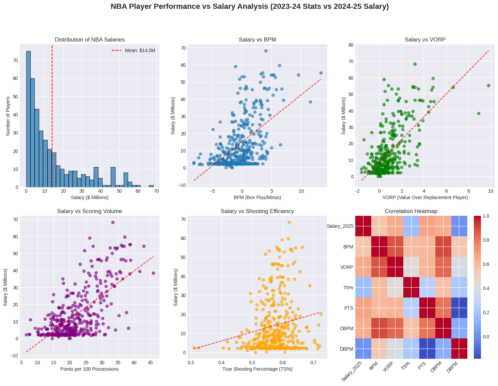
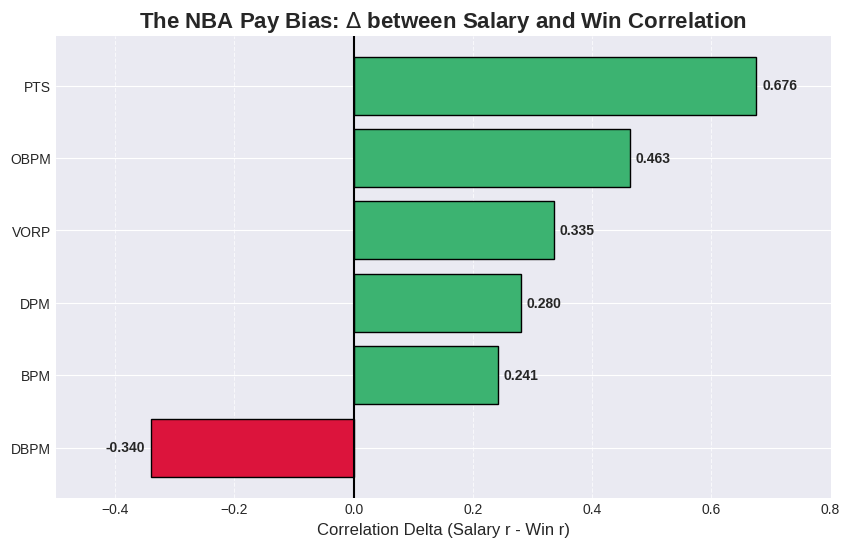
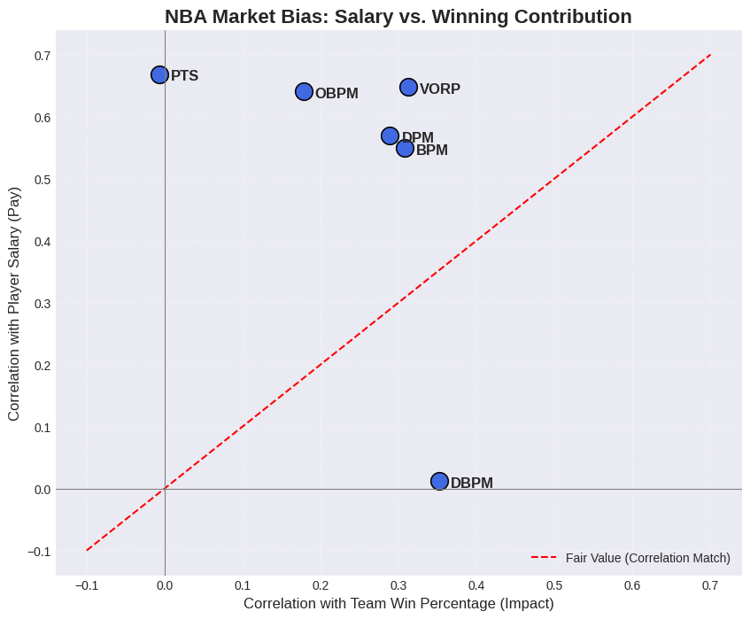
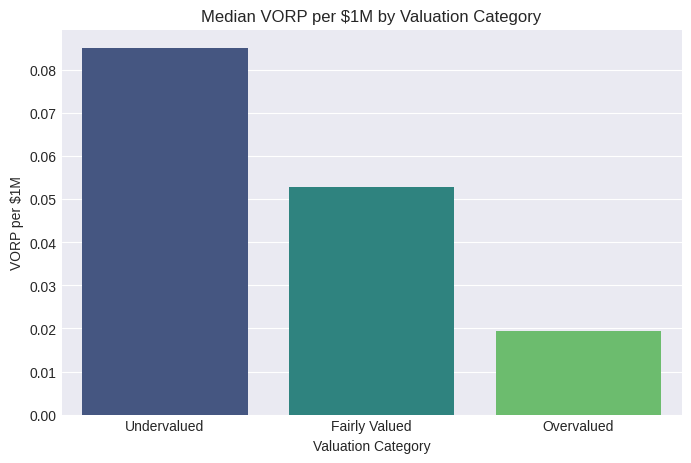

# NBA Player Valuation Analysis

<p align="center">
  
  
  
  
</p>

<p align="center">
  A full data science pipeline to detect <b>undervalued</b> and <b>overvalued</b> NBA players by comparing salary market price to model-estimated market value.
</p>

<p align="center">
  
</p>

## Project Snapshot

This project investigates a core NBA front-office question:

**Are teams paying for winning impact, or for market-favored signals?**

Using salary, advanced performance metrics, pace-adjusted stats, team context, and DARKO impact data, we build a player-level valuation framework and classify players into:

- `Undervalued`
- `Fairly Valued`
- `Overvalued`

The workflow is descriptive and decision-support oriented: it is meant to surface market inefficiencies, not claim causal truth.

## Key Results

| Metric | Result |
|---|---|
| Final merged player sample | `389` players |
| Best-performing model | `Quantile (Median) Regressor` |
| Best model R^2 | `0.676` |
| Final full-data R^2 (after floor handling) | `0.672` |
| NBA minimum salary floor applied | `$1,157,153` |
| Predictions adjusted below floor | `38` |
| Undervalued players | `153` (`39.3%`) |
| Fairly valued players | `92` (`23.7%`) |
| Overvalued players | `144` (`37.0%`) |
| Validation signal (`VORP_per_Million`) | Undervalued `0.0851` > Fairly valued `0.0527` > Overvalued `0.0194` |

## Methodology

```mermaid
flowchart LR
    A[Collect Raw Data] --> B[Clean and Standardize]
    B --> C[Merge to Player-Level Dataset]
    C --> D[Feature Engineering]
    D --> E[Train Multiple Regressors]
    E --> F[Select Best Model by R2]
    F --> G[Predict Market Value]
    G --> H[Compute Value Ratio]
    H --> I[Classify Undervalued Fairly Valued Overvalued]
    I --> J[Validate with VORP per Million]
```



### Valuation Formula

- `Predicted_Market_Value`: model-estimated salary mirror
- `Value_Ratio = Salary_2025 / Predicted_Market_Value`

Classification rules:

- `< 0.8` -> `Undervalued`
- `0.8 to 1.2` -> `Fairly Valued`
- `> 1.2` -> `Overvalued`

## Data Sources

| Dataset | File | Purpose |
|---|---|---|
| NBA salary data | `NBA_Player_Salary.csv` | Market price signal |
| Advanced player stats | `NBA_2025_advanced.csv` | Efficiency and impact metrics |
| Per-100 possession stats | `NBA_2025_per_poss.csv` | Pace-adjusted production |
| Team standings | `NBA_Team_Standings_2025.csv` | Team winning context |
| DARKO player impact | `DARKO_Player_Stats.csv` | Independent impact signal |


## Visual Results

<p align="center">
  
  
</p>
<p align="center">
  
</p>

## Tech Stack

- Python
- Pandas, NumPy
- Seaborn, Matplotlib
- scikit-learn
- XGBoost
- Jupyter Notebook / Google Colab

## Run Locally

### 1) Create environment and install dependencies

```powershell
python -m venv .venv
.venv\Scripts\Activate.ps1
pip install pandas numpy matplotlib seaborn scikit-learn xgboost jupyter
```

### 2) Launch notebook

```powershell
jupyter notebook
```

Open:

- `SC3021_SDAB_Group_8 (updated as of 7.4.26).ipynb`

### 3) Reproduce outputs

Run all cells from top to bottom to regenerate:

- `Final Dataset.csv`
- `NBA PLAYER VALUE CLASSFICATION.csv`

## Practical Uses

- Build undervalued-player shortlists for scouting/trade ideas
- Flag potentially overvalued contracts for roster strategy review
- Track pricing bias season-over-season by re-running the pipeline

## Scope, Ethics, and Limits

- Results are sample-based associations for this dataset and setup
- Outputs should support decision-makers, not replace human judgment
- Data used is public and non-personal

## Team

SC3021 Data Science Project  
Lab Group: `SDAB`  
Group: `08`

- Seth Yew
- John
- Hemang Karthick

